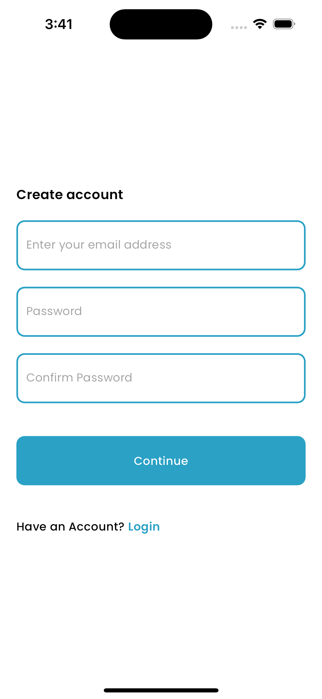
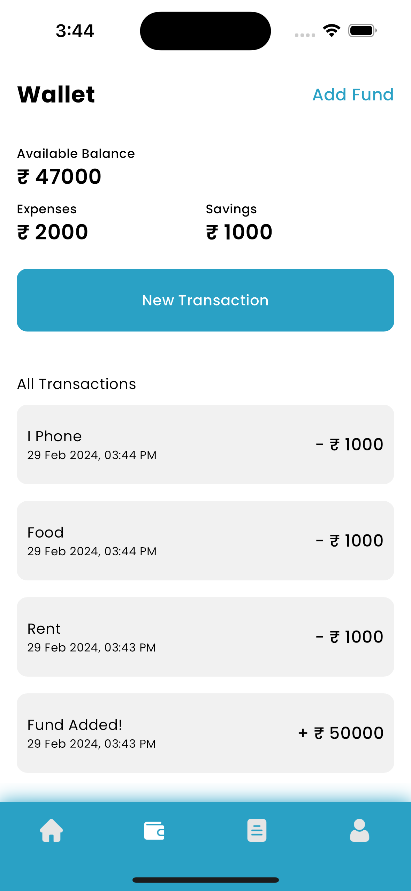
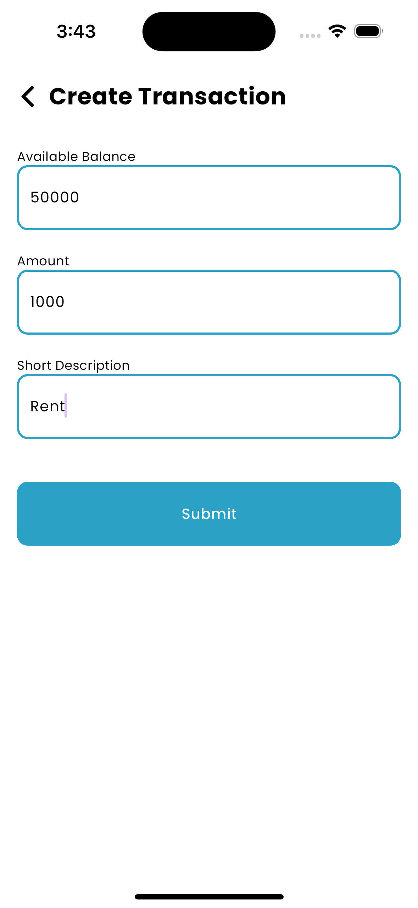
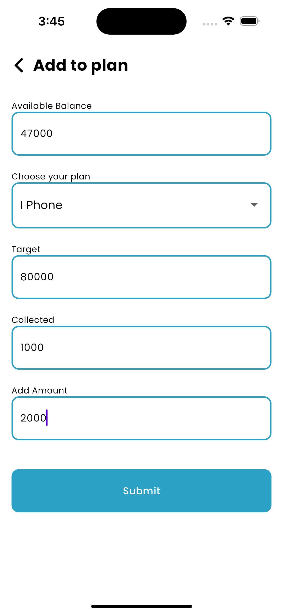
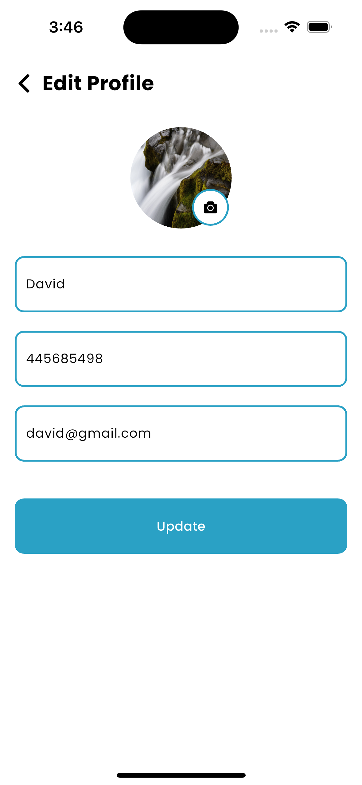
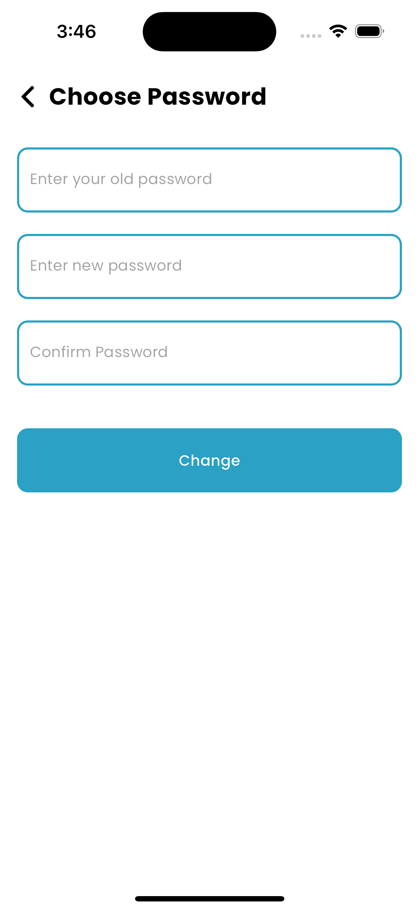
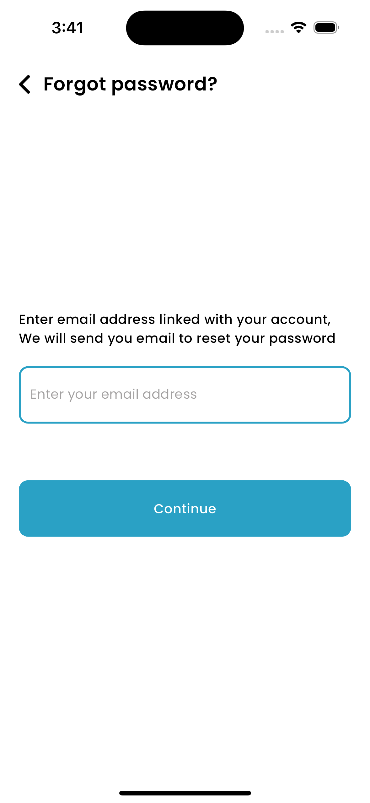

<!-- # Expense Calculator

Expense Calculator is a comprehensive Flutter application designed to provide users with powerful tools for managing their finances efficiently. It offers a range of features including authentication, transaction tracking, fund management, goal planning, and profile customization.

## Features

### Authentication
* Secure user authentication system allowing users to log in securely.

### User Registration
* New users can easily create accounts to access the application.

### Forgot Password
* Provides a user interface for resetting forgotten passwords.

### Home Page
* Users can Add funds to their account.
* Get a quick overview of their financial status with summary details.
* Access their last transactions for quick reference.

### Wallet Page
* Users can Add funds to their account.
* View detailed summary of expenses and savings.
* Create transactions for expenses or savings, with customizable categories.
* Track transaction history with filtering and search functionalities.

### Goal Planning
* Users can set financial goals and create plans to achieve them.

### Profile and Settings
* Users can Update their profile details such as name, email, and profile picture.
* Change their password securely.

## Technology Stack
* Flutter: Cross-platform framework for building mobile applications.
* Bloc: Utilizes the powerful BLoC (Business Logic Component) pattern for efficient state management and separation of concerns.
* Firebase Firestore: Leveraging the Firestore NoSQL cloud database by Firebase for secure and scalable data storage.
* Firebase Storage: Utilizes Firebase Storage for storing user profile images securely.

Yo can download the apk from the [link](https://drive.google.com/file/d/12GLAEqH0mp08iGAACUc_o90LTZlC53EP/view?usp=sharing)

## Screen shots
 -->
